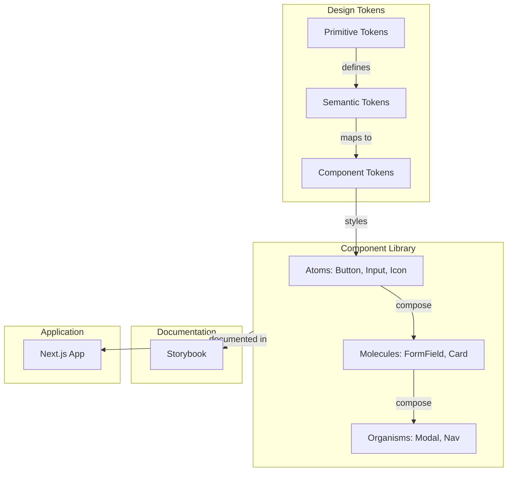

# AI Workflow Design: AI Design System Diagram Assistant

## Overview

The AI layer handles three main workflows:
1. **Prompt Enhancement** — improve raw user input for better diagrams
2. **Diagram Generation** — create Mermaid diagrams from enhanced prompts
3. **Diagram Refinement** — modify existing diagrams based on follow-up instructions

All AI calls use OpenAI GPT-4o with `response_format: { type: "json_object" }` for structured output.

---

## Stage 1: Input Normalization

**Purpose**: Clean and validate user input before AI processing.

### Stage 1: Input Analysis & Intent Classification

Before processing, the system classifies the user's intent to determine the refinement strategy.

| Intent | Criteria | Strategy |
|--------|----------|----------|
| **NEW_DIAGRAM** | No active conversation or "start over" keywords | Full generation |
| **PATCH_CHANGE** | Specific edit to existing node/edge | Incremental Mermaid update |
| **ADD_ELEMENT** | Request to add new component/layer | Append to Mermaid source |
| **REMOVE_ELEMENT** | Request to delete component/layer | Remove from Mermaid source |
| **STYLE_CHANGE** | Color, font, or theme request | **Visual Style state update** |
| **EXPLAIN_ONLY** | Question about the diagram | RAG (Retrieve Explanation) |
| **REGENERATE** | "Ignore previous and start over" | Full replacement |

---

### Stage 2: Prompt Enhancement & Metadata Enrichment

The AI rewrites the raw input into a structured instruction set.

**Metadata Enrichment (New)**:
For every node identified, the AI must generate:
1. `tooltip_title`: Clear name (e.g., "Semantic Tokens")
2. `tooltip_description`: Brief definition (e.g., "Standardized values like `color.brand.primary`...")
3. `role`: Structural purpose (e.g., "Style Foundation")
4. `importance`: low | medium | high
5. `connections_summary`: How it relates to neighbors

---

### Stage 3: Incremental Refinement Pipeline

For refinements (Intent: PATCH/ADD/REMOVE), the engine uses a **Stabilized Context Window**:

1. **Load State**: Retrieve `vN` Mermaid source, nodes, and edges.
2. **Minimal Edit Instruction**: AI is prompted to ONLY return the lines in Mermaid that need modification.
3. **Topology Preservation**: System enforces nodes not mentioned in the refinement remain unchanged.
4. **Style Preservation**: Visual style settings from `vN` are applied to `vN+1`.

---

### Stage 4: Style Change Guardrail

To ensure performance and stability, visual style changes are handled without full AI regeneration where possible.

**Flow**:
1. User: "Make the nodes blue"
2. System identifies `STYLE_CHANGE`
3. System updates the `DiagramStyle` object
4. Frontend re-renders using CSS/Mermaid style overrides
5. No Mermaid source mutation unless AI determines a specific semantic node-level style is required.

**Purpose**: Identify design-system-relevant entities and relationships in the raw input.

**What to extract**:
- **Entities**: tokens, components, themes, layers, tools (Figma, Storybook, etc.)
- **Relationships**: depends-on, contains, feeds-into, exports-to, extends
- **Diagram type signal**: architecture (layered), hierarchy (tree), token (pipeline), workflow (sequential)
- **Scope indicators**: single team, multi-team, enterprise, starter

**This stage is embedded within the enhancement prompt** — not a separate AI call.

---

## Stage 3: Prompt Enhancement

**Purpose**: Rewrite the raw user input into a high-quality diagram-generation prompt.

**AI Call**: Single call with enhancement system prompt (see `.windsurf/prompts.md` Prompt 1).

**Input**:
```json
{
  "raw_prompt": "Create a design system for a Next.js app",
  "source": "text",
  "diagram_type": "auto"
}
```

**Output**:
```json
{
  "enhanced_prompt": "Generate a design system architecture diagram showing: primitive design tokens (colors, spacing, typography), semantic tokens (brand, feedback, surface), a React component library (atoms: Button, Input, Icon; molecules: FormField, Card; organisms: Modal, Navigation), a Tailwind-based theme layer, Storybook documentation, and a Next.js application consuming the component library. Show dependencies between layers flowing top-to-bottom.",
  "diagram_goal": "Visualize the complete design system architecture for a Next.js application",
  "detected_diagram_type": "design-system-architecture",
  "entities": ["primitive tokens", "semantic tokens", "React component library", "Tailwind theme", "Storybook", "Next.js app"],
  "relationships": [
    {"from": "primitive tokens", "to": "semantic tokens", "type": "feeds-into"},
    {"from": "semantic tokens", "to": "component library", "type": "feeds-into"},
    {"from": "component library", "to": "Storybook", "type": "documented-by"},
    {"from": "component library", "to": "Next.js app", "type": "consumed-by"}
  ],
  "structure_hints": "top-down layered architecture with 4-5 layers",
  "assumptions": ["Using Tailwind for styling", "Storybook for documentation", "Atomic design pattern for components"]
}
```

---

## Stage 4: Diagram Type Classification

**Purpose**: Select the best diagram type when user chooses "auto".

**Classification logic** (embedded in enhancement):

| Signal in Input | Classified As |
|----------------|---------------|
| "architecture", "layers", "system", "overview" | design-system-architecture |
| "components", "hierarchy", "structure", "atoms", "molecules" | component-hierarchy |
| "tokens", "variables", "colors", "spacing", "semantic" | token-architecture |
| "workflow", "process", "Figma to code", "pipeline" | design-to-code-workflow |
| Ambiguous | design-system-architecture (default) |

---

## Stage 5: Provider-Specific Prompt Adaptation

**Purpose**: Adapt the enhanced prompt for the specific diagram provider.

### Mermaid Provider (MVP)

The Mermaid generation prompt instructs the AI to:
1. Choose appropriate Mermaid diagram type (`flowchart TD`, `flowchart LR`, `graph`)
2. Use `subgraph` for logical grouping
3. Use meaningful node IDs and labels
4. Add arrow labels for relationship types
5. Keep diagram readable (5-15 nodes)

**Template selection based on type**:
| Diagram Type | Mermaid Template | Layout |
|-------------|------------------|--------|
| design-system-architecture | Flowchart TD with subgraphs | Top-down |
| component-hierarchy | Flowchart TD (tree) | Top-down |
| token-architecture | Flowchart LR (pipeline) | Left-right |
| design-to-code-workflow | Flowchart LR (sequential) | Left-right |

### Eraser Provider (Future)

Will adapt the enhanced prompt into Eraser's expected format:
- Entity declarations
- Relationship arrows
- Grouping brackets
- Layout hints

---

## Stage 6: Diagram Generation

**Purpose**: Call AI to produce the actual diagram.

**AI Call**: Using diagram-type-specific prompt (see `.windsurf/prompts.md` Prompts 2-5, 7).

**Output Schema**:
```json
{
  "title": "Design System Architecture",
  "diagram_type": "design-system-architecture",
  "mermaid_source": "flowchart TD\n  subgraph Tokens\n    PT[Primitive Tokens]\n    ST[Semantic Tokens]\n  end\n  ...",
  "explanation": "This diagram shows the layered architecture of a design system with tokens feeding into components, documented in Storybook, and consumed by the Next.js application."
}
```

---

## Stage 7: Diagram Validation

**Purpose**: Ensure generated diagram is valid before returning to frontend.

**Validation checks**:
1. JSON response matches expected schema
2. `mermaid_source` is non-empty
3. Basic Mermaid syntax validation (has nodes, has connections)
4. Node count: minimum 3, maximum 25
5. Title and explanation are non-empty

**If validation fails** → proceed to repair (Stage 8).

---

## Stage 8: Repair/Retry Strategy

**Purpose**: Recover from invalid AI output.

**Flow**:
```
Invalid output detected
  → Attempt 1: Send repair prompt with error details
  → If repaired: return fixed diagram
  → If still invalid: return error to user
```

**Repair prompt** includes:
- The invalid output
- The specific error (e.g., "invalid Mermaid syntax at line 5")
- Instruction to fix only the structural issue

**Maximum retries**: 1 (total 2 attempts including original)

---

## Stage 9: Follow-up Refinement

**Purpose**: Modify existing diagram based on conversational follow-up.

**AI Call**: Using refinement prompt (see `.windsurf/prompts.md` Prompt 6).

**Input to AI**:
- Current Mermaid diagram source
- Conversation summary (condensed if >5 messages)
- Follow-up instruction
- Instruction to preserve unchanged elements

**Rules for refinement AI**:
1. Keep all existing nodes/edges unless explicitly asked to remove
2. Add new elements as requested
3. Maintain consistent style (node naming, layout direction)
4. Return full updated diagram (not just diff)
5. List changes in `changes_summary`

**Context preservation strategy**:
- Messages 1-5: Include full conversation history
- Messages 6+: AI-generated summary of earlier context + last 3 messages
- Always include current diagram source

---

## Stage 10: Explanation Generation

**Purpose**: Provide human-readable explanation of the diagram.

**This is included in the generation response** (not a separate call).

The generation prompt asks AI to include:
- 1-3 sentence explanation of what the diagram shows
- Who it's useful for
- Key relationships highlighted

---

## Mermaid Generation Strategy

### Best Practices for AI-generated Mermaid

1. **Use subgraphs** for logical grouping (layers, teams, tools)
2. **Short node IDs** with descriptive labels: `PT[Primitive Tokens]`
3. **Arrow labels** for relationship types: `PT -->|feeds into| ST`
4. **Consistent direction**: TD for hierarchies, LR for workflows
5. **5-15 nodes** for readability
6. **No special characters** in node IDs
7. **Proper escaping** in labels with special characters

### Example Output


---

## Context Preservation Strategy

### Short conversations (1-5 messages)
- Include full message history in refinement prompt
- Include full current diagram source

### Long conversations (6+ messages)
- Generate a context summary:
  - Original intent
  - Key entities established
  - Major changes made
  - Current diagram state
- Include summary + last 3 messages + current diagram

### Summarization prompt (invoked automatically when needed):
```
Summarize this design-system diagramming conversation in 3-5 sentences.
Focus on: original intent, key entities, major changes, current state.
```

---

## Error Categories and Recovery

| Error | Detection | Recovery |
|-------|-----------|----------|
| Invalid JSON from AI | JSON parse fails | Retry with repair prompt |
| Invalid Mermaid syntax | Regex/parser check | Retry with repair prompt |
| Empty diagram | Node count = 0 | Retry with "must include nodes" instruction |
| Irrelevant content | No design-system entities | Return error suggesting rephrase |
| Too complex (>25 nodes) | Node count check | Retry with "simplify" instruction |
| Timeout | >15 seconds | Return error, suggest retry |
| Rate limit | OpenAI 429 response | Return error, suggest waiting |
